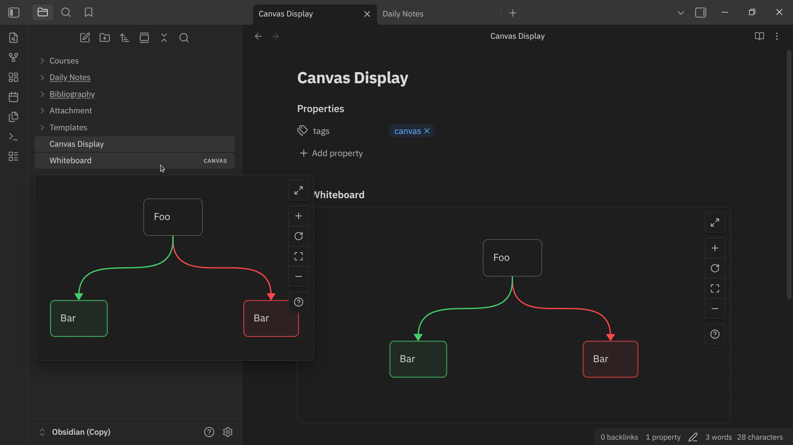

# Better Embedded Canvas - Obsdian Plugin

![latest-version] ![current-downloads] ![current-stars] ![open-issues]

Give your embedded canvas better display and interactivity.



## 🚀 Features

- Give embedded canvas the same look as canvas view.
- Navigate using panning and zooming to move across the canvas.
- Adjust the height of the embedded canvas in the note.
- Work on both page preview and canvas.

## 📦 Installation

- Manual
    - Create a folder named `better-embedded-canvas` under `YOUR_VAULT_NAME/.obsidian/plugins`.
    - Place `manifest.json`, `main.js`, and `style.css` from the latest release into the folder.
    - Enable it through the "Community plugin" setting tab.
- In-app (coming soon...)
- Using [BRAT][].

## ✍️ Usage

Use internal link prefixed with an exclamation mark (`!`) to embed a canvas. For example:

```markdown
![[My canvas.canvas]]
```

You can also adjust the height of the canvas by adding a bar (`|`) and number to the link destination. For example:

```markdown
![[My canvas.canvas|500]]
```

> [!Note]
>
> The minimum height of an embedded canvas is 300. The height adjusted below 300 will be rounded up to 300.

To learn how to interact with a canvas, refer [here][canvas-help].

## ⚠️ Limitation

Embedded canvas cannot be edited directly. To do that, open the canvas directly.

## ©️ Attribution

This plugin includes some of the type definitions developed by [Michael Naumov][mnaoumov], [Fevol][fevol], and the others at [Obsidian Typings][obsidian-typings], with some adjustments. All their works are licensed under MIT.

## 🙏 Acknowledgment

Thanks to:
- [Michael Naumov][mnaoumov], [Fevol][fevol], and the others at [Obsidian Typings][obsidian-typings].

[BRAT]: https://github.com/TfTHacker/obsidian42-brat
[canvas-help]: https://obsidian.md/help/plugins/canvas
[obsidian-typings]: https://github.com/obsidian-typings/obsidian-typings
[mnaoumov]: https://github.com/mnaoumov
[fevol]: https://github.com/Fevol

[latest-version]: https://img.shields.io/github/manifest-json/v/kotaindah55/better-embedded-canvas?label=version&link=https%3A%2F%2Fgithub.com%2Fkotaindah55%2Fbetter-embedded-canvas%2Freleases
[current-downloads]: https://img.shields.io/github/downloads/kotaindah55/better-embedded-canvas/total?link=https%3A%2F%2Fgithub.com%2Fkotaindah55%2Fbetter-embedded-canvas
[current-stars]: https://img.shields.io/github/stars/kotaindah55/better-embedded-canvas?style=flat&link=https%3A%2F%2Fgithub.com%2Fkotaindah55%2Fbetter-embedded-canvas%2Fstargazers
[open-issues]: https://img.shields.io/github/issues-search?query=repo%3Akotaindah55%2Fbetter-embedded-canvas%20is%3Aopen&label=open%20issues&color=red&link=https%3A%2F%2Fgithub.com%2Fkotaindah55%2Fbetter-embedded-canvas%2Fissues
