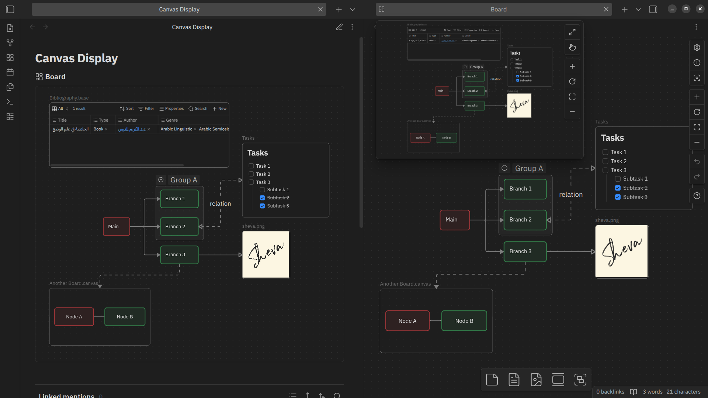
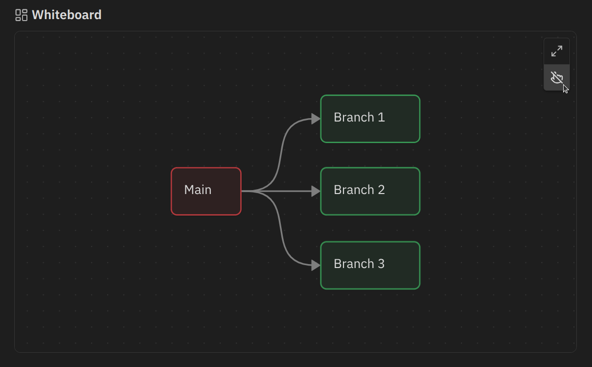

# Better Embedded Canvas - Obsdian Plugin

![latest-version] ![current-downloads] ![current-stars] ![open-issues]

Give your embedded canvas better display and interactivity.



> ⤿ Theme: [Adwaita][adwaita-theme] (title bar). Other plugin: [Advanced Canvas][advanced-canvas].

> [!NOTE]
>
> Although this plugin already fulfills the need for a full preview of embedded canvas, I still strongly support including this feature as a built-in feature. Visit [here][embedded-canvas-fr] to give your support.

## 🚀 Features

- Give embedded canvas the same look as canvas view.
- Navigate using panning and zooming to move across the canvas.
- Adjust the height of the embedded canvas in the note.
- Work on both page preview and canvas.
- Display embedded canvas on exported PDF.
- Support [Advanced Canvas][advanced-canvas] plugin.

## 📦 Installation

- Manual
    - Create a folder named `better-embedded-canvas` under `YOUR_VAULT_NAME/.obsidian/plugins`.
    - Place `manifest.json`, `main.js`, and `style.css` from the latest release into the folder.
    - Enable it through the "Community plugin" setting tab.
- In-app
    - Open settings.
    - Choose "Community plugins" setting tab.
    - Turn off "Restricted mode" if it was enabled before.
    - Click "Browse" at "Community plugins" item.
    - Type "Better Embedded Canvas" in the search box.
    - Install and enable it.
- Using [BRAT][].

## ✍️ Usage

### Embedding canvas into your note

Use internal link prefixed with an exclamation mark (`!`) to embed a canvas. For example:

```markdown
![[My canvas.canvas]]
```

You can also adjust the height of the canvas by adding a bar (`|`) and number to the link destination. For example:

```markdown
![[My canvas.canvas|500]]
```

> [!Note]
>
> The minimum height of an embedded canvas is 300. The height adjusted below 300 will be rounded up to 300.

### Interacting with embedded canvas

You can interact with an embedded canvas in the same way as you do with a full canvas view. If you prefer no interaction, you can disable it by selecting hand pointer iconed button in the upper-right corner.



To learn how to interact with canvas, refer [here][canvas-help].

### Toggle canvas name

By default, the name of embedded canvas is displayed as embed title. You can hide it by going to **Settings** → **Better Embedded Canvas**, then select **Show canvas name** and disable it.

## ⚠️ Limitation

Embedded canvas cannot be edited directly. To do that, open the canvas directly.

## 🐞 Known issues

- [x] Embedded canvas nodes are not positioned properly in exported PDF.

## ©️ Attribution

This plugin includes some of the type definitions developed by [Michael Naumov][mnaoumov], [Fevol][fevol], and the others at [Obsidian Typings][obsidian-typings], with some adjustments. All their works are licensed under MIT.

## 🙏 Acknowledgment

Thanks to:
- [Michael Naumov][mnaoumov], [Fevol][fevol], and the others at [Obsidian Typings][obsidian-typings].

[BRAT]: https://github.com/TfTHacker/obsidian42-brat
[advanced-canvas]: https://community.obsidian.md/plugins/advanced-canvas
[canvas-help]: https://obsidian.md/help/plugins/canvas
[obsidian-typings]: https://github.com/obsidian-typings/obsidian-typings
[mnaoumov]: https://github.com/mnaoumov
[fevol]: https://github.com/Fevol
[adwaita-theme]: https://community.obsidian.md/themes/adwaita
[embedded-canvas-fr]: https://forum.obsidian.md/t/show-a-complete-preview-of-the-canvas-including-text-when-a-canvas-is-embedded-in-a-note/51614

[latest-version]: https://img.shields.io/github/manifest-json/v/kotaindah55/better-embedded-canvas?label=version&link=https%3A%2F%2Fgithub.com%2Fkotaindah55%2Fbetter-embedded-canvas%2Freleases
[current-downloads]: https://img.shields.io/github/downloads/kotaindah55/better-embedded-canvas/total?link=https%3A%2F%2Fgithub.com%2Fkotaindah55%2Fbetter-embedded-canvas
[current-stars]: https://img.shields.io/github/stars/kotaindah55/better-embedded-canvas?style=flat&link=https%3A%2F%2Fgithub.com%2Fkotaindah55%2Fbetter-embedded-canvas%2Fstargazers
[open-issues]: https://img.shields.io/github/issues-search?query=repo%3Akotaindah55%2Fbetter-embedded-canvas%20is%3Aopen&label=open%20issues&color=red&link=https%3A%2F%2Fgithub.com%2Fkotaindah55%2Fbetter-embedded-canvas%2Fissues
