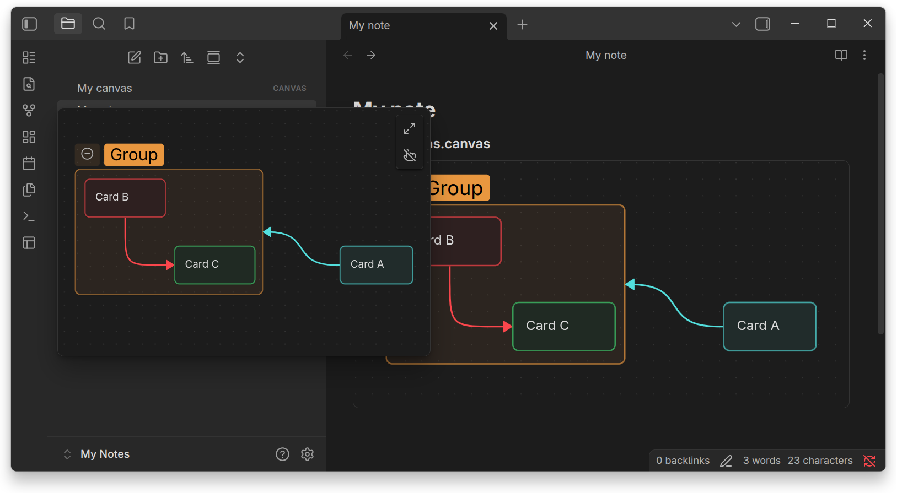
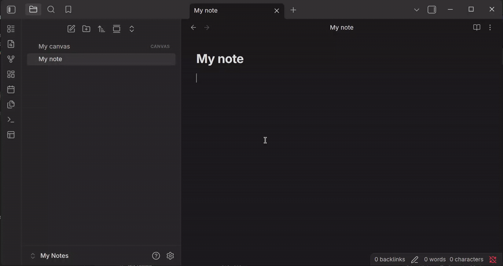
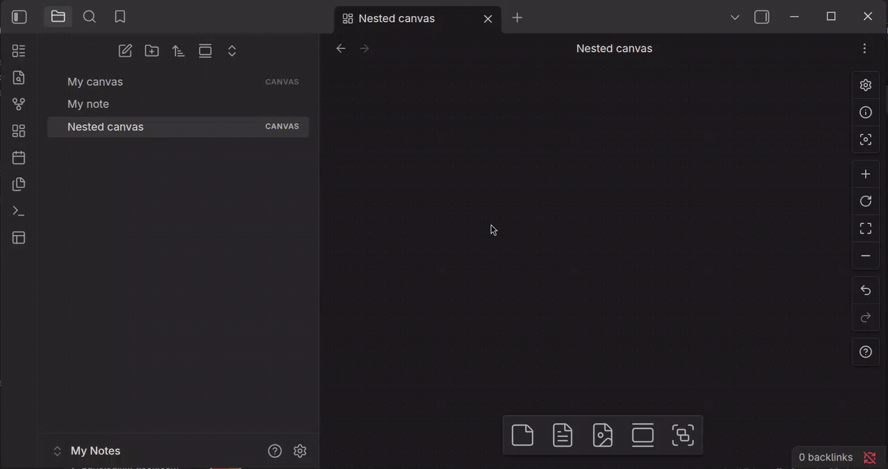
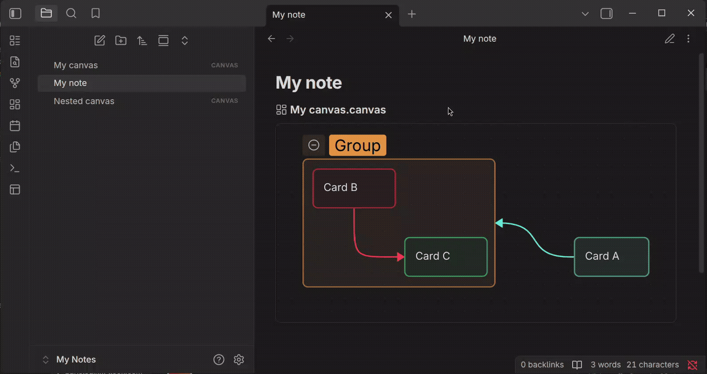
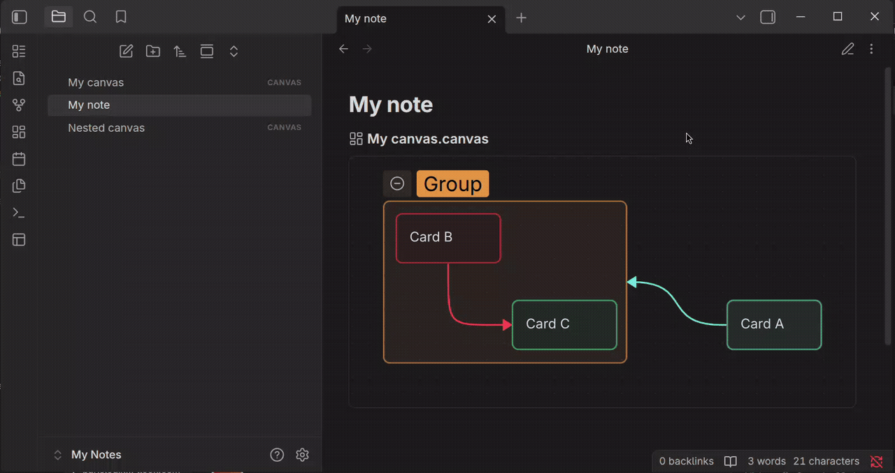
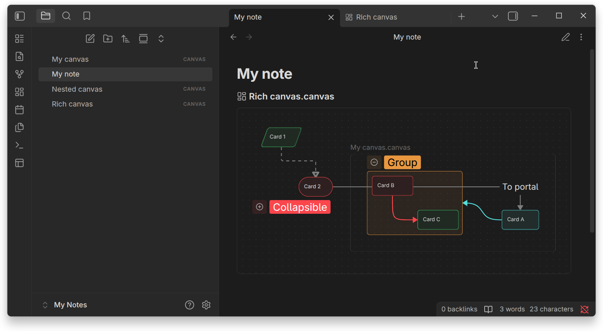

# Better Embedded Canvas - Obsdian Plugin

![latest-version] ![current-downloads] ![current-stars] ![open-issues]

Give your embedded canvas better display and interactivity.



> [!NOTE]
>
> Although this plugin already fulfills the need for a full preview of embedded canvas, I still strongly support including this feature as a built-in feature. Visit [here][embedded-canvas-fr] to give your support.

> [!WARNING]
>
> This plugin uses monkey patch and accesses internal API to unlock features that cannot be provided using public API alone.

## Overview

- **Canvas embedding**: Embed canvas or specific card while preserving original canvas view interface.
- **Hover preview**: Preview canvas by hovering the cursor over a link or file.
- **Basic interaction**: Navigate using panning and zooming across the canvas.
- **Advanced canvas support**: Support advanced customization from [Advanced Canvas][advanced-canvas].

## Installation

### In-app installation

1. Open settings.
2. Choose "Community plugins" setting tab.
3. Turn off "Restricted mode" if it was enabled before.
4. Click "Browse" at "Community plugins" item.
5. Type "Better Embedded Canvas" in the search box.
6. Install and enable it.

### Manual installation

1. Create a folder named `better-embedded-canvas` under `YOUR_VAULT_NAME/.obsidian/plugins`.
2. Place `manifest.json`, `main.js`, and `style.css` from the latest release into the folder.
3. Enable it through the "Community plugin" setting tab.

### Using [BRAT][].

## Features and Usage

### Embed canvas in a note



You can embed a canvas in a note using the same way as [embedding notes and other files][obsidian-help-embeds]. To do that, use internal link prefixed with an exclamation mark (`!`):

```markdown
![[My canvas.canvas]]
```

#### Adjust the height

To adjust the height of an embedded canvas, add a vertical bar (`|`) followed by the length of the height:

```markdown
![[My canvas.canvas|500]]
```

By default, the height will be adjusted to 300. Therefore, `![[My canvas.canvas]]` has the same result as `![[My canvas.canvas|300]]`.

> [!NOTE]
>
> Currently, Better Embedded Canvas limits the minimum height to 300. Any canvas height adjusted to less than 300 will be rounded up to 300. Therefore, `![[My canvas.canvas|200]]` has the same result as `![[My canvas.canvas|300]]`.

#### Change the title

The title of an embedded canvas is located at the top of the embed, prefixed with canvas icon (![lucide-layout-dashboard]).

By default, the title is the name of the canvas file. To change it, add a vertical bar (`|`) followed by the replacement title:

```markdown
![[My canvas.canvas|My diagram]]
```

If you want to change the title while also adjusting the height, place the replacement title first then the height, separated by vertical bar (`|`):

```markdown
![[My canvas.canvas|My diagram|500]]
```

You can also hide the title globally by disabling it under **Settings** → **Better Embedded Canvas** → **Show canvas title**.

#### Embed single card

You can embed single card in a note instead of the whole canvas. To do that, add a hash (`#`) at the end of the link destination, followed by the card id:

```markdown
![[My canvas.canvas#00b6cc18e01988a6]]
```

You can adjust the title and the height by adding them after the card id.

```markdown
With custom title:
![[My canvas.canvas#00b6cc18e01988a6|My card]]

With adjusted height:
![[My canvas.canvas#00b6cc18e01988a6|500]]

With both:
![[My canvas.canvas#00b6cc18e01988a6|My card|500]]
```

You can change how the card embed should be displayed:
- Enable **Settings → Better Embedded Canvas → Card embed → Embed card content only** to embed only the content of the text card. Or, disable it to embed the card along with the canvas interface.
- Enable **Settings → Better Embedded Canvas → Card embed → Embed cards without group** to hide group card while only show the cards inside. Or, disable it to show the group card instead.

Searching and typing card id manually can be very inconvinient. Therefore, Better Embedded Canvas provides autocompletion for that. To use autocompletion:
1. Type a hash (`#`) at the end of the link destination (as mentioned before). Autocompletion popover will be shown right after that.
2. You can search for specific card by the content of text card, the name of the group card, or the card id itself.
3. Select the card you want to embed.

> [!NOTE]
>
> Autocompletion suggests text and group cards only.

> [!NOTE]
>
> Group card is suffixed with group icon (![lucide-group]) in autocompletion popover.

#### Drag and drop functionality

You can drag the title of an embedded canvas, then you can drop it on a tab header to open the canvas there, into an editor to insert it as a link, or into a canvas view to embed it as a card.

### Embed a canvas in a canvas



You can embed a canvas in another canvas using the same way as [adding a card from a note][obsidian-help-canvas-add-note-card].

To embed a canvas from your vault:
1. Select or drag the document icon (![lucide-file-text]) at the bottom of the canvas.
2. Select the canvas you want to embed.

You can also embed a canvas from the canvas context menu:
1. Right-click the canvas and then select **Add note from vault**.
2. Select the canvas you want to embed.

You can also drag a canvas from the File explorer, or an embedded canvas from a note, into the canvas.

> [!WARNING]
>
> Try to avoid embedding a canvas in the canvas itself or any embedding that creates circular referencing as it can causes performance issue.

### Preview a canvas



You can preview a canvas by hovering the cursor over an internal link to the canvas in Editing view, File explorer, Search, and more. The behavior of the preview depends on [Page preview][obsidian-help-page-preview] plugin.

> [!NOTE]
>
> To preview a canvas, you first need to enable [Page preview][obsidian-help-page-preview] plugin.

### Interact with an embedded canvas



You can interact with an embedded canvas the way [interacting with a canvas view][obsidian-help-canvas], with some limitations.

> [!NOTE]
>
> Embedded canvas is set to read-only. Therefore, you cannot add, delete, edit, or move cards and connection lines. To do that, open canvas view instead.

#### Select cards

To select single card or cards, you can use any of the following approaches:
- Select individual cards.
- Drag a selection around multiple cards.
- Add and remove cards from an existing selection by pressing <kbd>Shift</kbd> and selecting them.

To scroll the content of a card, you first need to select it.

> [!NOTE]
>
> You cannot use <kbd>Ctrl</kbd> <kbd>A</kbd> (or <kbd>Cmd</kbd> <kbd>A</kbd> on macOS) to select all cards.

#### Pan canvas

To pan an embedded canvas, you can use any of the following approaches:
- Press <kbd>Space</kbd> and drag the canvas. It does not apply on canvas embedded within another canvas.
- Drag the canvas using the middle mouse button (or tap on mobile).
- Scroll the mouse to pan vertically, and press <kbd>Shift</kbd> while scrolling to pan horizontally.

#### Zoom manually

To zoom an embedded manually, press <kbd>Space</kbd> or <kbd>Ctrl</kbd> (or <kbd>Cmd</kbd> on macOS) and scroll using the mouse wheel. Or, select **Zoom in** (![lucide-plus]) and **Zoom out** (![lucide-minus]) from the zoom controls in the upper-right corner.

#### Zoom to fit

To zoom the canvas so that every item is visible, select **Zoom to fit** (![lucide-maximize]) from the zoom controls in the upper-right corner.

#### Zoom to selection

To zoom the canvas so that all selected items are visible, right-click selected card or cards and then select **Zoom to selection**.

#### Reset zoom

To change the zoom level back to the default, select **Reset zoom** (![lucide-rotate-cw]) from the zoom controls in the upper-right corner.

#### Toggle interaction

When interaction is disabled, the embedded canvas will prevent user from interacting with the canvas, including selecting cards, panning, and zooming.

To toggle interaction, select pointing hand icon (![lucide-pointer]) in the upper-right corner. This will toggle interaction globally and save the current interaction state.

#### Open in canvas view

To open an embedded canvas in canvas view, select **Open canvas** (![lucide-maximize-2]) in the upper-right corner.

### [Advanced Canvas][advanced-canvas] support



Embedded canvas includes some of Advanced Canvas' notable features (you need to enable Advanced Canvas plugin):
- Card and connection line (node and edge) styling.
- Collapsible group.
- Portal.

However, some of other features collide with Better Embedded Canvas' features:
- Single card embed.
- Single card link autocompletion.

In the case of collided features, Better Embedded Canvas takes precedence over Advanced Canvas. This is simply because those collided features, i.e. single card embed and autocompletion, includes enhancement that Advanced Canvas does not have.

Nevertheless, you can have Better Embedded Canvas and Advanced Canvas enabled simultaneously without expecting significant conflicts.

> [!NOTE]
>
> Sometimes, right after enabling or disabling any of Better Embedded Canvas and Advanced Canvas, you will get a notification to reload all notes or to restart the app. It should only happen once until you enable or disable any of those two plugins.

## Attribution

This plugin includes some of the type definitions developed by [Michael Naumov][mnaoumov], [Fevol][fevol], and the others at [Obsidian Typings][obsidian-typings], with some adjustments. All their works are licensed under MIT.

## Acknowledgment

Thanks to:
- [Michael Naumov][mnaoumov], [Fevol][fevol], and the others at [Obsidian Typings][obsidian-typings].
- [mika.dev][developer-mike] at [Advanced Canvas][advanced-canvas].

[obsidian-help-canvas]: https://obsidian.md/help/plugins/canvas
[obsidian-help-canvas-add-note-card]: https://obsidian.md/help/plugins/canvas#Add+cards+from+notes
[obsidian-help-embeds]: https://obsidian.md/help/embeds
[obsidian-help-links]: https://obsidian.md/help/links
[obsidian-help-links-heading]: https://obsidian.md/help/links#Link+to+a+heading+in+a+note
[obsidian-help-page-preview]: https://obsidian.md/help/plugins/page-preview

[BRAT]: https://github.com/TfTHacker/obsidian42-brat
[advanced-canvas]: https://community.obsidian.md/plugins/advanced-canvas
[obsidian-typings]: https://github.com/obsidian-typings/obsidian-typings
[mnaoumov]: https://github.com/mnaoumov
[fevol]: https://github.com/Fevol
[developer-mike]: https://github.com/Developer-Mike
[embedded-canvas-fr]: https://forum.obsidian.md/t/show-a-complete-preview-of-the-canvas-including-text-when-a-canvas-is-embedded-in-a-note/51614

[lucide-file-text]: https://unpkg.com/lucide-static@latest/icons/file-text.svg
[lucide-group]: https://unpkg.com/lucide-static@latest/icons/group.svg
[lucide-layout-dashboard]: https://unpkg.com/lucide-static@latest/icons/layout-dashboard.svg
[lucide-maximize]: https://unpkg.com/lucide-static@latest/icons/maximize.svg
[lucide-maximize-2]: https://unpkg.com/lucide-static@latest/icons/maximize-2.svg
[lucide-minus]: https://unpkg.com/lucide-static@latest/icons/minus.svg
[lucide-plus]: https://unpkg.com/lucide-static@latest/icons/plus.svg
[lucide-pointer]: https://unpkg.com/lucide-static@latest/icons/pointer.svg
[lucide-rotate-cw]: https://unpkg.com/lucide-static@latest/icons/rotate-cw.svg

[latest-version]: https://img.shields.io/github/manifest-json/v/kotaindah55/better-embedded-canvas?label=version&link=https%3A%2F%2Fgithub.com%2Fkotaindah55%2Fbetter-embedded-canvas%2Freleases
[current-downloads]: https://img.shields.io/badge/dynamic/json?url=https%3A%2F%2Fgithub.com%2Fobsidianmd%2Fobsidian-releases%2Fraw%2Frefs%2Fheads%2Fmaster%2Fcommunity-plugin-stats.json&query=%24.better-embedded-canvas.downloads&label=downloads&color=green
[current-stars]: https://img.shields.io/github/stars/kotaindah55/better-embedded-canvas?style=flat&link=https%3A%2F%2Fgithub.com%2Fkotaindah55%2Fbetter-embedded-canvas%2Fstargazers
[open-issues]: https://img.shields.io/github/issues-search?query=repo%3Akotaindah55%2Fbetter-embedded-canvas%20is%3Aopen&label=open%20issues&color=red&link=https%3A%2F%2Fgithub.com%2Fkotaindah55%2Fbetter-embedded-canvas%2Fissues
